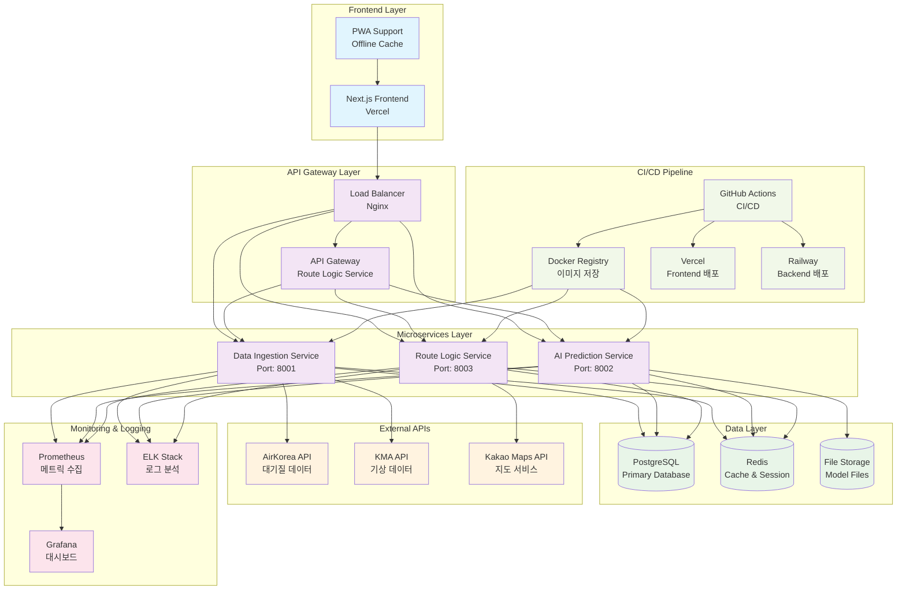
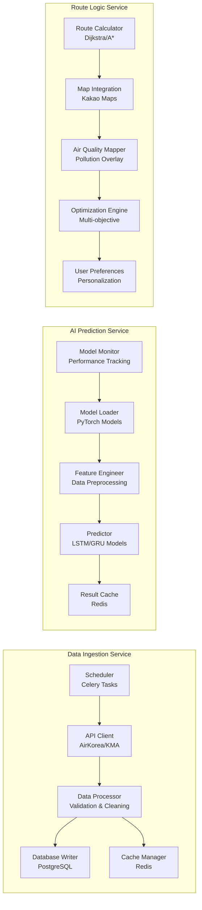
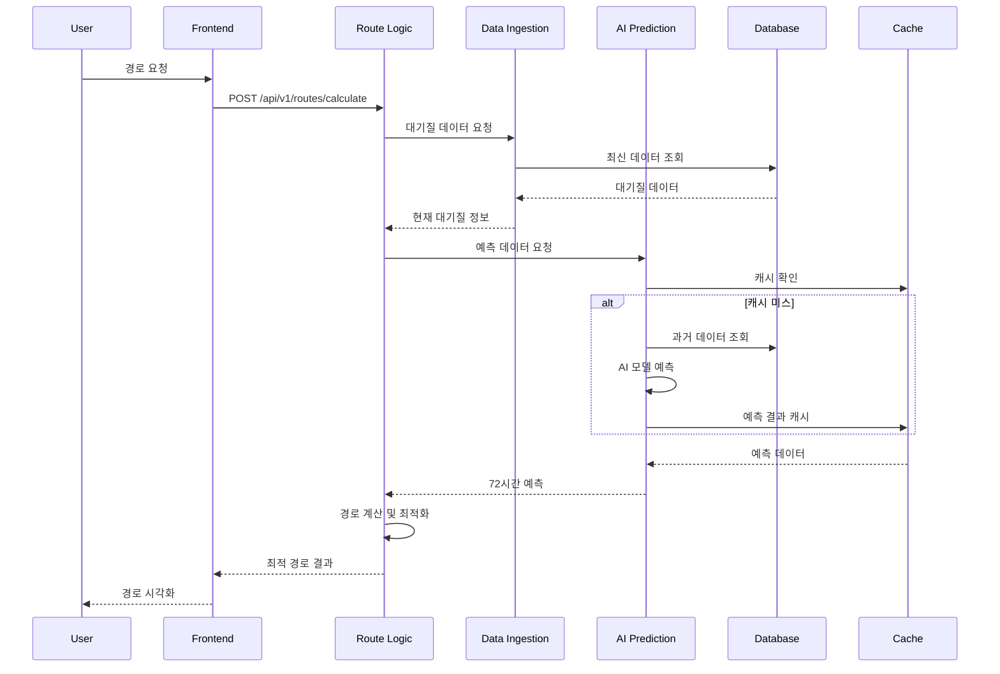
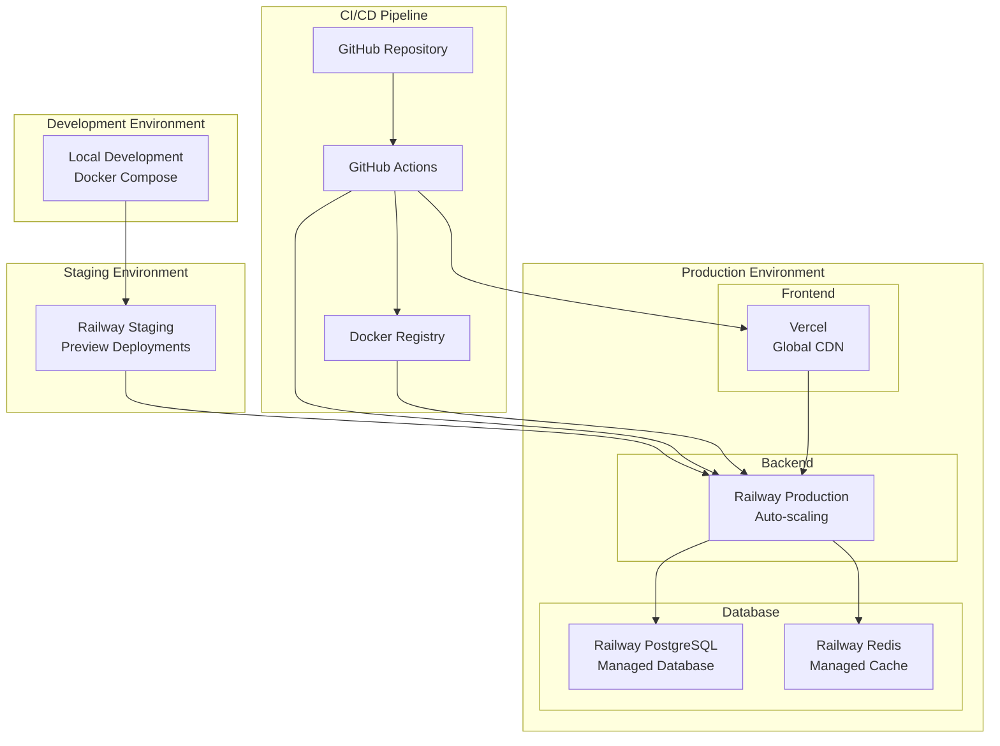
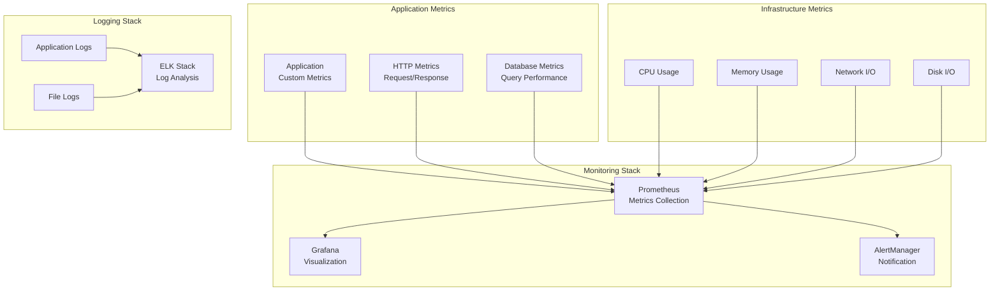

# 시스템 아키텍처

## 1. 전체 시스템 아키텍처 다이어그램

## 2. 마이크로서비스 상세 아키텍처

## 3. 데이터 플로우 다이어그램

## 4. 배포 아키텍처

## 5. 보안 아키텍처

```mermaid
graph TB
    subgraph "Security Layers"
        WAF[Web Application Firewall<br/>DDoS Protection]
        LB[Load Balancer<br/>SSL Termination]
        AG[API Gateway<br/>Rate Limiting]
        AUTH[Authentication<br/>JWT Tokens]
        RBAC[Role-Based Access Control]
    end
    
    subgraph "Network Security"
        VPC[Virtual Private Cloud]
        SG[Security Groups]
        NACL[Network ACLs]
    end
    
    subgraph "Data Security"
        ENC[Data Encryption<br/>At Rest & In Transit]
        BACKUP[Automated Backups]
        AUDIT[Audit Logging]
    end
    
    WAF --> LB
    LB --> AG
    AG --> AUTH
    AUTH --> RBAC
    
    VPC --> SG
    SG --> NACL
    
    ENC --> BACKUP
    BACKUP --> AUDIT
```

## 6. 모니터링 아키텍처

## 7. 확장성 고려사항

### 7.1 수평 확장 (Horizontal Scaling)
- **로드 밸런서**: Nginx를 통한 트래픽 분산
- **마이크로서비스**: 각 서비스 독립적 확장
- **데이터베이스**: 읽기 전용 복제본 활용
- **캐시**: Redis 클러스터 구성

### 7.2 수직 확장 (Vertical Scaling)
- **컨테이너 리소스**: CPU/메모리 동적 조정
- **데이터베이스**: 인스턴스 크기 확장
- **AI 모델**: GPU 인스턴스 활용

### 7.3 자동 확장 (Auto Scaling)
- **Railway**: 트래픽 기반 자동 확장
- **Vercel**: 글로벌 CDN 자동 최적화
- **모니터링**: 메트릭 기반 알림 및 조치

이 시스템 아키텍처는 확장 가능하고 안정적인 클라우드 네이티브 애플리케이션을 위한 종합적인 설계를 제시합니다.
